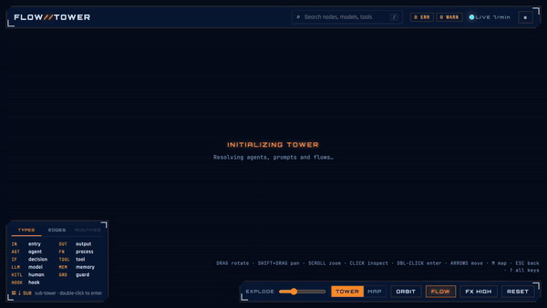
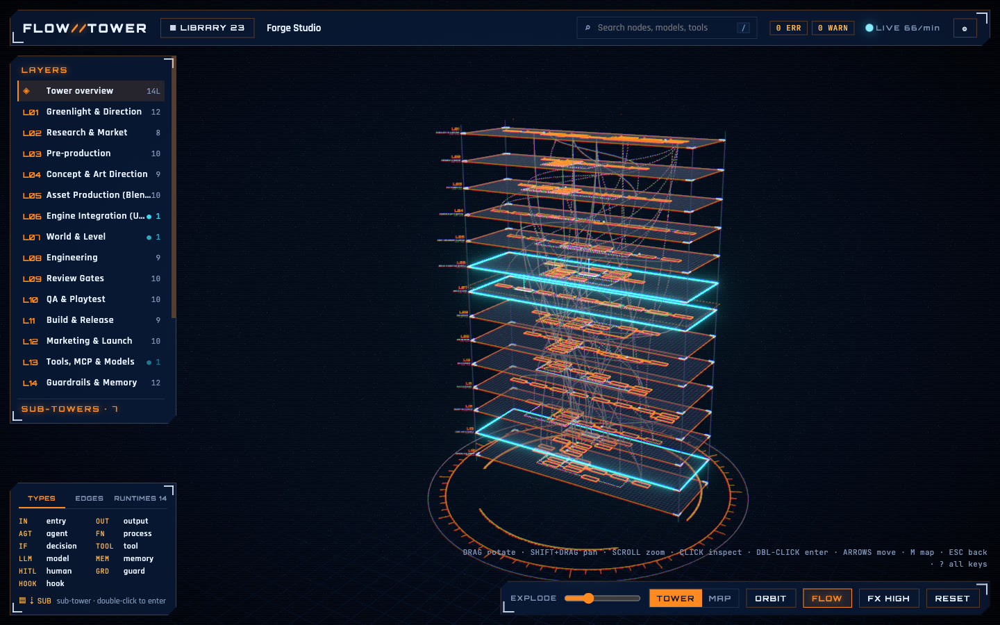
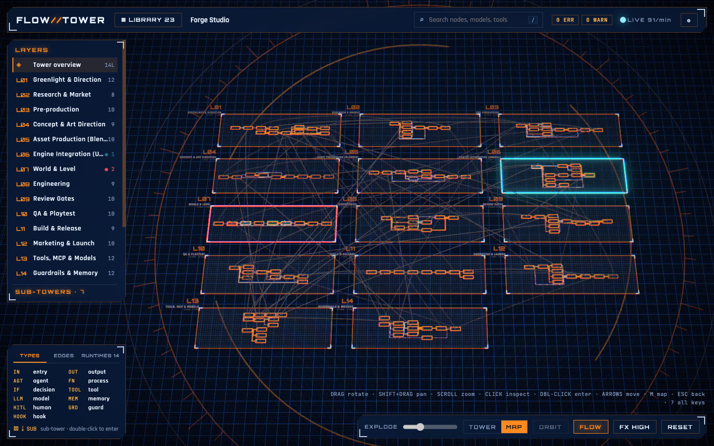
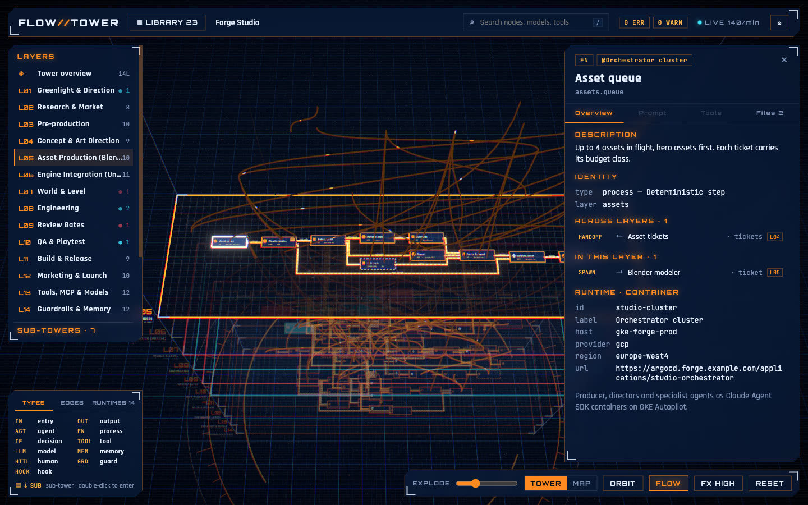

# Flow Tower

**See the whole structure of an agentic system at once.** Flow Tower renders AI agents and multi-agent systems as an interactive 3D tower. Each layer is a left-to-right flowchart. Click any node to open its system prompt, tools, model, harness settings, files, logs and the services it runs on.



<sub>Full video (27 s, higher quality): [docs/demo.mp4](docs/demo.mp4). Recorded with the live simulator running.</sub>

**[Try the live demo →](https://jamesmoriartydecripto.github.io/flow-tower/)** All 30 example projects in your browser, with simulated live events. Nothing to install. Press `?` for the keyboard shortcuts.

- **One YAML file per system.** It is easy to write and review, and it lives in the same repo as the agent.
- **Tower of layers.** Stack layers like intake, orchestration, specialists, tools, guardrails, memory and models. Cross-layer links show who calls whom.
- **Nested towers.** An agent can contain its own tower. Double-click it to dive in, as deep as you need.
- **Real files.** Prompts, code, configs and logs open in a syntax-highlighted viewer; Markdown is formatted, with math in `$$…$$` rendered by KaTeX. Existing Claude Code agents (`.claude/agents/*.md`) import as they are.
- **Hybrid deployments.** `runtimes` show what runs on a laptop, a server, a CI job or a third-party service.
- **Structural changes.** Mark nodes `planned`, `experimental` or `deprecated`.
- **How it runs in production.** Triggers, human approvals with timeouts, budgets, limits, fan-out, data sensitivity, evals, rollouts and SLAs show on the nodes and in the node panel.
- **Library.** Point it at a folder and browse every project you work on. Switch between a stacked tower and a top-down map.
- **Keyboard first.** Arrows walk nodes and layers, Enter dives into sub-towers or the node panel, `?` lists every shortcut. Settings cover themes, fonts, interface size and animations.
- **Voice.** Press V and talk to the tower, in Italian, English or any language: "open dev squad", "explain the flow of the first layer", "show me this node's files", "spiegami questo file". It answers out loud and shows what it talks about ([details](#voice-commands)).
- **Node list.** Focus a layer and its nodes are listed on the right in flow order, readable however far the cards are.
- **Live.** Save the YAML, or any referenced file, and the tower updates.
- **Generate towers with any coding agent.** Claude Code, Codex, Pi, Hermes, Cursor or any other agent reads an agentic codebase and writes a validated tower. It maps Claude Code, the Agent SDK, LangGraph, CrewAI, OpenAI Agents, Pi, Hermes and more.
- **Realtime agents.** Connect Claude Code, the Agent SDK, Codex, Pi, Hermes or your own loops. Active nodes light up, errors flash, and a live feed shows every step. See [docs/realtime.md](docs/realtime.md).

| Tower | Map |
|---|---|
|  |  |
| **Node panel** | **Library** |
|  |  |

## Quick start

```bash
git clone https://github.com/JamesMoriartyDecripto/flow-tower.git
cd flow-tower && npm install
npm run dev                                  # library of the bundled examples
node bin/flow-tower.js path/to/agent.tower.yaml
node bin/flow-tower.js ~/projects            # every *.tower.yaml found, as a library
node bin/flow-tower.js init my-agent.tower.yaml   # starter file
node bin/flow-tower.js other.tower.yaml --port 5318  # a second server next to the first
node bin/flow-tower.js my.tower.yaml --browser firefox   # another browser (or set $BROWSER)
```

Requires Node 22.12 or newer. The app runs locally on `127.0.0.1`. Nothing is uploaded.

## A tower in 30 lines

```yaml
# yaml-language-server: $schema=./schema/flow-tower.schema.json
name: Research Agent
runtimes:
  laptop: { kind: local }
  search: { kind: saas, provider: brave }
prompts:
  main: { file: prompts/main.md }
agents:
  lead: { model: claude-opus-5-5, prompt: main, tools: [web_search], runtime: laptop }
  critic: { from: .claude/agents/critic.md }
layers:
  - id: loop
    title: Agent Loop
    nodes:
      - { id: ask, type: entry, label: User question }
      - { id: lead, agent: lead }
      - { id: review, agent: critic }
      - { id: ok, type: decision, label: Good enough? }
      - { id: answer, type: output, label: Answer }
    edges:
      - ask -> lead
      - lead -> review [handoff]
      - review -> ok
      - "ok -> lead [return]: no, max 3"
      - "ok -> answer: yes"
  - id: tools
    title: Tools
    nodes:
      - { id: web_search, type: tool, label: Web search, runtime: search }
links:
  - loop.lead -> tools.web_search [call]
```

See the full **[schema reference](docs/schema.md)**, and **[what goes where](docs/what-goes-where.md)** for what belongs in layers, nodes, edges and nested towers. A generated JSON Schema (`schema/flow-tower.schema.json`) gives autocomplete in VS Code.

## Examples

Start small with a **starter** (one short YAML file), or open a preset close to your system. The full index, by pattern, is in **[examples/README.md](examples/README.md)**.

| Starters | Layers |
|---|---|
| [`single-agent`](examples/starters/single-agent): one agent in a tool loop | 1 |
| [`rag-bot`](examples/starters/rag-bot): nightly ingestion + cited Q&A | 2 |
| [`pr-reviewer`](examples/starters/pr-reviewer): GitHub Actions PR review with approval | 3 |
| [`voice-assistant`](examples/starters/voice-assistant): on-device voice around Claude | 3 |

**Presets**: software delivery ([`dev-squad`](examples/dev-squad)), game studio ([`game-studio`](examples/game-studio)), courses ([`course-studio`](examples/course-studio)), websites ([`web-studio`](examples/web-studio)), SRE ([`sre-incident`](examples/sre-incident)), fraud review ([`fraud-desk`](examples/fraud-desk)), deep research ([`deep-research`](examples/deep-research)), AI co-scientist ([`co-scientist`](examples/co-scientist)), customer service ([`airline-support`](examples/airline-support)), chief of staff ([`chief-of-staff`](examples/chief-of-staff)), browser automation ([`browser-worker`](examples/browser-worker)), A2A commerce ([`a2a-concierge`](examples/a2a-concierge)), legal due diligence ([`legal-diligence`](examples/legal-diligence)), Jev decision layer ([`jev-agent`](examples/jev-agent)), social media ([`social-studio`](examples/social-studio)), AI video ([`ai-video-studio`](examples/ai-video-studio)), ebooks ([`ebook-studio`](examples/ebook-studio)), mobile apps ([`mobile-studio`](examples/mobile-studio)), marketing ([`marketing-studio`](examples/marketing-studio)), B2B sales to invoice ([`sales-pipeline`](examples/sales-pipeline)), Italian e-invoicing with Fatture in Cloud ([`invoicing-fic`](examples/invoicing-fic)).

Every example ships real prompt, agent, code, config and log files, so the popups have something to show, and a README with its sources.

## Generate a tower from your code (any coding agent)

Your coding agent reads the codebase and writes the tower. The procedure is harness-neutral: [docs/generate-a-tower.md](docs/generate-a-tower.md). Install it as an [Agent Skill](https://agentskills.io) for your agent:

```bash
node bin/flow-tower.js install-skill                  # Claude Code: ~/.claude/skills
node bin/flow-tower.js install-skill --target codex   # Codex: ~/.agents/skills
node bin/flow-tower.js install-skill --target pi      # Pi: ~/.pi/agent/skills
node bin/flow-tower.js install-skill --target hermes  # Hermes Agent: ~/.hermes/skills
node bin/flow-tower.js install-skill --target cursor  # Cursor: ~/.cursor/skills
node bin/flow-tower.js install-skill --target agents  # shared ~/.agents/skills (Agent Skills clients)
# add --project to install into the current project instead (e.g. ./.claude/skills)
```

Then ask your agent, inside any agent project: *"map this agent system into a flow tower"*. Any other agent works too: tell it to run `node <flow-tower>/bin/flow-tower.js guide` and follow the printed procedure. Agents that clone this repo find the same pointer in [AGENTS.md](AGENTS.md). The procedure:
1. inventories agents, prompts, tools/MCP, hooks, memory, models, runtimes and logs, from the code only;
2. writes `<system>.tower.yaml`, plus nested towers when needed;
3. runs `flow-tower validate` until there are no errors or warnings.

Run it again later to update the tower, or to mark parts as deprecated or planned.

```bash
node bin/flow-tower.js validate path/to/agent.tower.yaml [--json]   # also great in CI
```

## Live events

```bash
npm run simulate -- game-studio        # see it without wiring anything
flow-tower emit --kind tool.start --agent coder --tool Bash -m "npm test"   # after `npm link` here
```

Ready-made configs for Claude Code, the Agent SDK, Codex, Pi and Hermes are in [`integrations/`](integrations).

**Tokens and cost per node:** point Claude Code's or Codex's OpenTelemetry exporter at Flow Tower (OTLP/HTTP JSON, `http://127.0.0.1:5317`) and each agent node shows what it spent; see [docs/realtime.md](docs/realtime.md#tokens-and-cost-opentelemetry).

## Controls

| Input | Action |
|---|---|
| Drag | Rotate |
| Right-drag, **Shift + drag**, **Shift + two-finger scroll** (trackpad) | Pan |
| Scroll, pinch | Zoom |
| Hover a layer | Lens: magnify it and spread the stack around it |
| Click node | Inspect it and highlight its upstream and downstream paths; the camera centers it and moves in close |
| Double-click node, **Enter**, or ⇣ in the Sub-towers list | Enter its sub-tower (marked by stacked plates and `⇣ SUB`) |
| **1–9**, **0** | Focus a layer / overview |
| **Esc**, **Backspace** | Go back (file, then selection, then layer, then parent tower) |
| **/** | Search nodes, models, tools |
| **L** | Project library |
| **M** | Switch Tower / Map view (map: layers side by side, seen from above); the choice also applies to sub-towers |
| **,** | Settings: theme, interface size and fonts, performance, effects, views, live behaviour |
| **← → ↑ ↓** | Move to the nearest node; ↑ ↓ cross to the layer above / below (library: move between cards) |
| **PgUp / PgDn** | Previous / next layer |
| **Shift / Alt + arrows**, **+ / −** | Orbit / pan / zoom the camera |
| **[ ]** | Previous / next tab of the selected node |
| **F**, **O** | Live feed, auto-orbit |
| **V** | Voice commands: start / stop listening (also in the library); see [Voice commands](#voice-commands) |
| **P**, **X** | Download a ZIP of every layer and the map of the project and its sub-towers: Full HD PNGs (plus the 3D view), or editable SVGs |
| **?** | Every keyboard shortcut |

Everything works without a mouse: **Tab** moves between HUD buttons, **Enter / Space** press them.

The bottom bar toggles orbit, flow particles and the rendering quality (`eco` / `balanced` / `high`), and has the PNG / SVG export buttons. You can also force a preset with `?quality=eco`.

Links can open a tower, a layer or a node directly: `?tower=request` (the id, the file name without `.tower.yaml`, or the name), `&layer=security` (focuses the layer), `&node=handle.problem` (selects the node). Handy for sharing and for screenshots.

## Voice commands

Press **V** or the **MIC** button (top bar or library header) and say where to go. When you stop speaking (about 0.6 s of silence), the browser sends the clip to the local server, which has it transcribed; the command is then matched in the page. A caption under the top bar shows what it heard and what it did.

**Setup.** Voice needs an [OpenRouter](https://openrouter.ai) API key. Put `OPENROUTER_API_KEY=...` in `~/.config/flow-tower/.env`, your own folder outside every repo (see [where your data lives](#where-your-data-lives)), or export it in your shell, then restart Flow Tower. The `.env` file in the flow-tower folder (git-ignored) still works as a fallback. The environment wins, then the user folder, then the repo folder. The key stays on the local server and never reaches the page. The online demo has no server, so it has no voice.

**Language.** Settings → Voice → Spoken language: Auto (detected from each clip), Italiano or English. Picking yours helps short commands. Command words forgive a misheard letter, and "vista …" / "… view" means the map unless you say tower.

| Italian | English | Does |
|---|---|---|
| "apri dev squad" | "open dev squad" | Open a project |
| "livello 3", "il terzo livello", "ultimo livello" | "layer 3", "third layer", "last layer" | Focus a layer by number |
| "livello memoria" | "memory layer" | Focus a layer by name |
| "vai al nodo triage", "agente reviewer" | "node triage", "agent reviewer" | Select a node or an agent |
| "vista mappa", "vista torre" | "map view", "tower view" | Switch view |
| "panoramica" | "overview" | The whole tower |
| "indietro" | "back" | Go back, like Esc |
| "libreria" | "library" | Project library |
| "spegni il microfono" | "stop listening" | Microphone off |

A name alone works too ("triage"). Names come from what is on screen: projects, layers, nodes and agents. They match loosely, so a misheard word still finds its target. When a name fits several things, the caption numbers them: say "il primo" or "two" to pick. "Entra" / "enter" opens the selected node's sub-tower, "chiudi" / "close" closes the panel. Listening stops by itself after 2 minutes without a command.

**Noise.** The microphone tells a voice from a fan by the shape of the sound, not only its loudness, after measuring the room in its first 0.7 s. If a laptop fan still starts clips by itself, set **Settings → Voice → Microphone sensitivity** to Low and speak a little louder; High suits quiet rooms and soft voices. A transcript that is only "Grazie." or "Thank you." is what the recognizer writes for noise, so it is ignored.

**Privacy.** Only clips with speech are sent (silence is dropped), only while the microphone is on. They go to OpenRouter (`openai/whisper-large-v3-turbo`), routed only to providers with zero data retention (`provider.zdr`). Commands are matched locally; no tower content is sent. Nothing else leaves your machine. `FLOW_TOWER_VOICE_MODEL` picks another model; `FLOW_TOWER_VOICE_ZDR=0` drops the zero-retention requirement.

**Cost.** OpenRouter bills speech-to-text per second of audio. A command is a second or two, a fraction of a cent. Measured once (illustrative): an Italian command was transcribed in about 1.2 s for about $0.000005.

**Browsers.** Firefox, Chrome, Safari and Edge behave the same: recording uses `MediaRecorder`, not the browser's own speech recognition.

### Talking with the tower

Questions, and anything the commands above do not cover, go to a voice agent that answers out loud in the language you spoke, and shows what it talks about:

| You say | It answers and shows |
|---|---|
| "cosa c'è nel secondo livello?" | the layer's nodes, and focuses it |
| "a cosa è collegato il triage?" | its incoming and outgoing edges, and selects it |
| "fammi vedere i file di questo nodo" → "apri il primo" | how many files there are, and opens the first in the viewer |
| "how many MCP servers are there?" | the count and names, highlighted on screen |
| "what does the fresh verifier do?" | its role, model and tools |

The agent reads the tower on screen through a dozen tools (layers, nodes, connections, files, search) and acts with the same commands as the keyboard, so its answers come from the tower, not from guesses. It keeps the last few exchanges, so "this node" and "the first one" work.

**Interrupting.** While it answers, and for 0.7 s after, the microphone ignores what it hears, so laptop speakers cannot make the agent answer itself. If you speak in that moment just after a reply, the caption says once "Wait a moment after the reply, or press Esc to interrupt it." Stop a reply with **Esc** (the microphone stays on), **V** or **✕** (both turn it off). Esc while the reply is still being written silences the rest of it and stops its tool calls too (the caption says "Stopped"). With headphones, turn on **Settings → Voice → Interrupt by voice**: three words or "stop" then cut the reply short while it is heard; before its first sentence plays, what you say is a normal command.

- **Models** (OpenRouter, zero data retention): `google/gemini-3.1-flash-lite` for the answers and `elevenlabs/eleven-flash-v2.5` for the voice, one voice for every language. Change them with `FLOW_TOWER_AGENT_MODEL`, `FLOW_TOWER_TTS_MODEL` and `FLOW_TOWER_TTS_VOICE`.
- **Settings → Voice → Spoken replies**: off shows the answers in the caption only.
- **Faster first audio (#70).** If the agent has not started its answer 600 ms after you stop speaking, a short cached phrase ("One moment.", "Un attimo.") plays first; first audio drops from 1.9–2.9 s to about 0.6 s.
- **Cost and speed** (measured once on dev-squad, illustrative): an answer took 1.1–2.9 s and about $0.001, and speaking it about 0.7 s more. Plain commands never reach the agent and stay instant.
- **Privacy:** the transcript, what is on screen and the tool results go to the model; no audio is kept. Nothing is logged unless you turn on the journal below.

### Learning from your sessions

Voice can learn from how you use it. It is off by default: turn it on in **Settings → Voice → Learn from my sessions**.

- **What is recorded.** Text only, never audio. One line per turn: what was heard, what happened, and how it went.
- **Outcome marks.** The outcome is corrected from what you do next: "no, the other one" marks the last turn *corrected*, "back" right after marks it *undone*, stopping a reply (Esc, or by voice) marks it *interrupted*.
- **Review.** After 20 new turns, a review runs when the microphone turns off. It costs about a cent with the default model. One runs at a time, and a failed one waits for 20 more turns. **Review now** runs one at any time.
- **Suggestions.** The review proposes aliases for names the recognizer mishears ("triaje" → triage), rules for the agent, and reply style. They change nothing until you accept them in Settings. The caption shows how many are waiting. Accepted rules and style notes are capped at 20 and 2000 characters in all (remove one to accept another), and the agent treats them as preferences: they never override its instructions, the tool results or what is on screen.
- **Forget everything** deletes the journal and all it learned. Each accepted item can also be removed alone.
- **Privacy.** Reviews send journal text to OpenRouter with zero data retention: transcripts and replies, which can quote tower names and file text.

### Where your data lives

Your own things stay in your user folder, never in a repo: `~/.config/flow-tower` (or `FLOW_TOWER_HOME`).

| File | Holds |
|---|---|
| `.env` | `OPENROUTER_API_KEY` |
| `voice-journal.jsonl` | the voice journal (only when learning is on) |
| `voice-memory.json` | accepted aliases and notes, waiting suggestions |

Flow Tower creates the folder, the journal and the memory readable by you only (a `FLOW_TOWER_HOME` folder you made yourself keeps its permissions), and rewrites the memory in one step (a crash never leaves half a file). No tower can read this folder or a secret file (key files, credentials, `.ssh`, `.git`…): `/api/file` never serves them, and a prompt `file:`, agent `from:` or nested tower pointing at one is refused by `validate` and the app ("is a secret file or in the user folder: not read"). Symlinks do not get around it: a tower file is checked by its real path before it is read, and folder scans skip links that leave the folder. If `FLOW_TOWER_HOME` points inside the flow-tower folder, the server warns at startup. The `.env` file in the flow-tower folder is only a git-ignored fallback for the key. Nothing personal is written in the repo.

## Performance

Flow Tower is meant to run next to busy agents, so it is frugal by design:

- **On-demand rendering.** Nothing is drawn unless something changed: camera, transitions, live events. In `eco` an idle tower costs **0 frames per second**.
- **FPS budget per preset:**

  | Preset | Cap | Post-processing |
  |---|---|---|
  | `eco` | 20 fps | none |
  | `balanced` (default) | 30 fps | light bloom |
  | `high` | 60 fps | full effects |

  The **FX** button cycles through them, or force one with `?quality=eco`.
- **Background.** When the window is not focused the canvas drops to 10 fps and stops decorative motion.
- **Batched scene.** Each layer is drawn with a handful of draw calls (instanced meshes, batched lines, troika `BatchedText`). Labels you could not read at the current zoom are skipped.

## Privacy and updates

Flow Tower runs on your machine: the server listens on `127.0.0.1` only, reads only inside your projects, and live events never leave your computer. It calls out in two cases only. **Voice** sends speech clips, questions and, if you turn learning on, journal reviews to OpenRouter with zero data retention, only when you use it and have set a key ([details](#voice-commands)). Your key, journal and voice memory stay in `~/.config/flow-tower` ([where your data lives](#where-your-data-lives)). The **update check** runs once a day: it asks GitHub for the latest release (`api.github.com/repos/JamesMoriartyDecripto/flow-tower/releases/latest`, nothing about you or your towers is sent). When a newer version exists, the terminal prints how to update and the top bar shows a small `↑ vX.Y.Z` link to the release notes. Turn it off with `--no-update-check` or `FLOW_TOWER_NO_UPDATE_CHECK=1`; it is always off in CI and in the online demo.

## Project layout

```
bin/            CLI: serve, init, validate, emit, guide, install-skill
src/core/       schema (zod), YAML loader, validation, live-event adapters and matching
src/server/     Vite plugin: /api/workspace, /api/file (read-only, sandboxed), /api/events, /api/voice (speech, agent, spoken replies, journal), live reload
src/app/        React + three.js app: scene/ (3D) and hud/ (overlay UI)
src/cli/        TypeScript CLI commands (validate)
schema/         generated JSON Schema
skills/         Agent Skill (SKILL.md) that generates towers from a codebase
integrations/   live-event configs for Claude Code, Agent SDK, Codex, Pi, Hermes
examples/       starters (1–3 layers) and researched presets, indexed by pattern in examples/README.md
scripts/        schema, stress-tower and event-simulator scripts
docs/           schema reference, architecture map, realtime guide, tower generation procedure
```

## Contributing

See [CONTRIBUTING.md](CONTRIBUTING.md). Please report security issues privately ([SECURITY.md](SECURITY.md)).

## License

[MIT](LICENSE)
