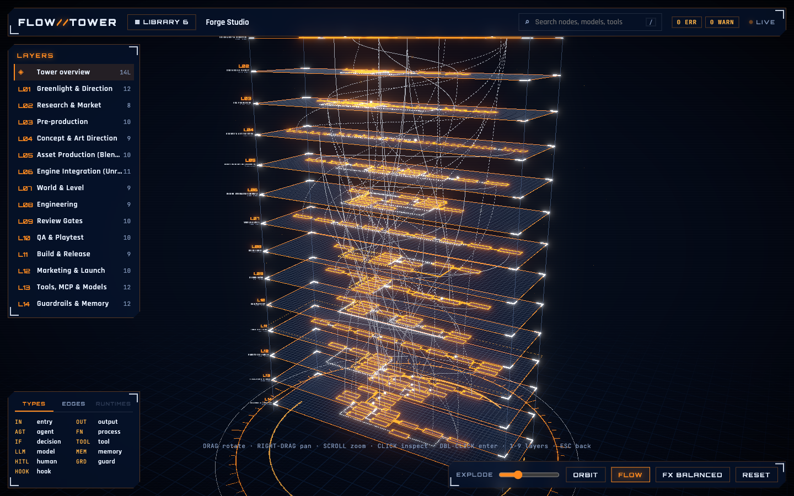
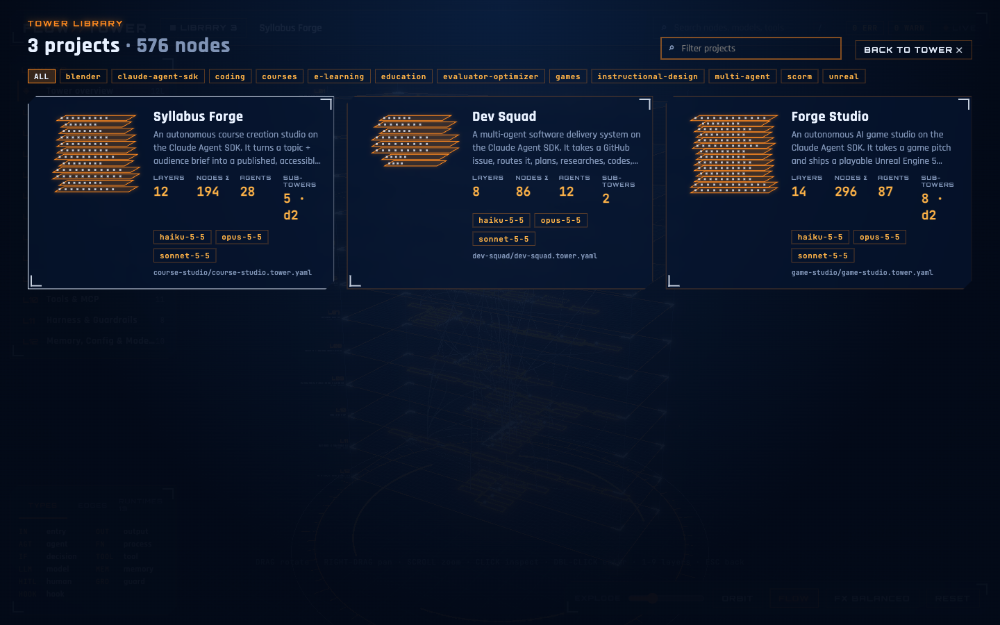

# Flow Tower

**See the whole structure of an agentic system at once.** Flow Tower renders AI agents and multi-agent systems as an interactive 3D tower. Each layer is a left-to-right flowchart. Click any node to open its system prompt, tools, model, harness settings, files, logs and the services it runs on.



- **One YAML file per system.** It is easy to write and review, and it lives in the same repo as the agent.
- **Tower of layers.** Stack layers like intake, orchestration, specialists, tools, guardrails, memory and models. Cross-layer links show who calls whom.
- **Nested towers.** An agent can contain its own tower. Double-click it to dive in, as deep as you need.
- **Real files.** Prompts, code, configs and logs open in a syntax-highlighted viewer. Existing Claude Code agents (`.claude/agents/*.md`) import as they are.
- **Hybrid deployments.** `runtimes` show what runs on a laptop, a server, a CI job or a third-party service.
- **Structural changes.** Mark nodes `planned`, `experimental` or `deprecated`.
- **Library.** Point it at a folder and browse every project you work on.
- **Live.** Save the YAML, or any referenced file, and the tower updates.
- **Generate towers with Claude Code.** The bundled skill reads an agentic codebase and writes a validated tower. It works with Claude Code, the Agent SDK, LangGraph, CrewAI, OpenAI Agents, Pi, Hermes and more.
- **Realtime agents.** Connect Claude Code, the Agent SDK, Pi, Hermes or your own loops. Active nodes light up, errors flash, and a live feed shows every step. See [docs/realtime.md](docs/realtime.md).



## Quick start

```bash
git clone https://github.com/JamesMoriartyDecripto/flow-tower.git
cd flow-tower && npm install
npm run dev                                  # library of the bundled examples
node bin/flow-tower.js path/to/agent.tower.yaml
node bin/flow-tower.js ~/projects            # every *.tower.yaml found, as a library
node bin/flow-tower.js init my-agent.tower.yaml   # starter file
```

Requires Node 22.12 or newer. The app runs locally on `127.0.0.1`. Nothing is uploaded.

## A tower in 30 lines

```yaml
# yaml-language-server: $schema=./schema/flow-tower.schema.json
name: Research Agent
runtimes:
  laptop: { kind: local }
  search: { kind: saas, provider: brave }
prompts:
  main: { file: prompts/main.md }
agents:
  lead: { model: claude-opus-5-5, prompt: main, tools: [web_search], runtime: laptop }
  critic: { from: .claude/agents/critic.md }
layers:
  - id: loop
    title: Agent Loop
    nodes:
      - { id: ask, type: entry, label: User question }
      - { id: lead, agent: lead }
      - { id: review, agent: critic }
      - { id: ok, type: decision, label: Good enough? }
      - { id: answer, type: output, label: Answer }
    edges:
      - ask -> lead
      - lead -> review [handoff]
      - review -> ok
      - "ok -> lead [return]: no, max 3"
      - "ok -> answer: yes"
  - id: tools
    title: Tools
    nodes:
      - { id: web_search, type: tool, label: Web search, runtime: search }
links:
  - loop.lead -> tools.web_search [call]
```

See the full **[schema reference](docs/schema.md)**. A generated JSON Schema (`schema/flow-tower.schema.json`) gives autocomplete in VS Code.

## Examples

| Preset | What it shows |
|---|---|
| [`dev-squad`](examples/dev-squad) | Software delivery on the Claude Agent SDK: triage, orchestrator-workers, review loop, hooks, MCP, memory |
| [`game-studio`](examples/game-studio) | AI game studio: design, concept art, Blender, Unreal, world generation, code review, QA bots, marketing. 140 nodes, nesting depth 2 |
| [`course-studio`](examples/course-studio) | Course creation: instructional design, parallel module writers, assessment, review board, SCORM/LMS publishing |

Every example ships real prompt, agent, code, config and log files, so the popups have something to show.

## Generate a tower from your code (Claude Code skill)

```bash
node bin/flow-tower.js install-skill            # into ~/.claude/skills (or --project for ./.claude/skills)
```

Then ask Claude Code, inside any agent project: *"map this agent system into a flow tower"*. The skill:
1. inventories agents, prompts, tools/MCP, hooks, memory, models, runtimes and logs, from the code only;
2. writes `<system>.tower.yaml`, plus nested towers when needed;
3. runs `flow-tower validate` until there are no errors or warnings.

Run it again later to update the tower, or to mark parts as deprecated or planned.

```bash
node bin/flow-tower.js validate path/to/agent.tower.yaml [--json]   # also great in CI
```

## Live events

```bash
npm run simulate -- game-studio        # see it without wiring anything
npx flow-tower emit --kind tool.start --agent coder --tool Bash -m "npm test"
```

Ready-made configs for Claude Code, the Agent SDK, Pi and Hermes are in [`integrations/`](integrations).

## Controls

| Input | Action |
|---|---|
| Drag | Rotate |
| Right-drag, **Shift + drag**, **Shift + two-finger scroll** (trackpad) | Pan |
| Scroll, pinch | Zoom |
| Click node | Inspect it and highlight its upstream and downstream paths |
| Double-click node, or **Enter** | Enter its sub-tower |
| **1–9**, **0** | Focus a layer / overview |
| **Esc**, **Backspace** | Go back (file, then selection, then layer, then parent tower) |
| **/** | Search nodes, models, tools |
| **L** | Project library |
| Hover a layer | Lens: magnify it and spread the stack around it |

The bottom bar toggles orbit, flow particles and the rendering quality (`high` / `balanced` / `low`). You can also force a preset with `?quality=low`.

## Performance

Flow Tower is meant to run next to busy agents, so it is frugal by design:

- **On-demand rendering.** Nothing is drawn unless something changed: camera, transitions, live events. In `eco` an idle tower costs **0 frames per second**.
- **FPS budget per preset:**

  | Preset | Cap | Post-processing |
  |---|---|---|
  | `eco` | 20 fps | none |
  | `balanced` (default) | 30 fps | light bloom |
  | `high` | 60 fps | full effects |

  The **FX** button cycles through them, or force one with `?quality=eco`.
- **Background.** When the window is not focused the canvas drops to 10 fps and stops decorative motion.
- **Batched scene.** Each layer is drawn with a handful of draw calls (instanced meshes, batched lines, troika `BatchedText`). Labels you could not read at the current zoom are skipped.

## Project layout

```
bin/            CLI: serve, init, validate, emit, install-skill
src/core/       schema (zod), YAML loader, validation, live-event adapters and matching
src/server/     Vite plugin: /api/workspace, /api/file (read-only, sandboxed), /api/events, live reload
src/app/        React + three.js app: scene/ (3D) and hud/ (overlay UI)
src/cli/        TypeScript CLI commands (validate)
schema/         generated JSON Schema
skills/         Claude Code skill that generates towers from a codebase
integrations/   live-event configs for Claude Code, Agent SDK, Pi, Hermes
examples/       reference towers (coding, game dev, course creation)
scripts/        schema, stress-tower and event-simulator scripts
docs/           schema reference, realtime guide
```

## Contributing

See [CONTRIBUTING.md](CONTRIBUTING.md). Please report security issues privately ([SECURITY.md](SECURITY.md)).

## License

[MIT](LICENSE)
